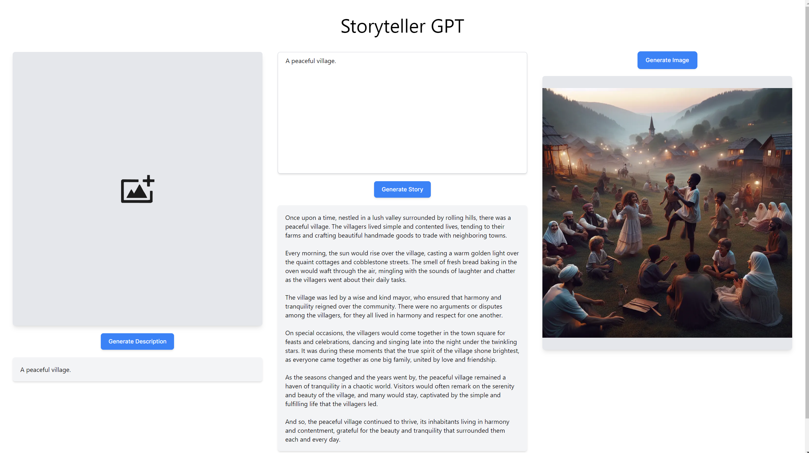

# Storyteller GPT

## Specification

1. Create a page to upload images and process them with Computer Vision.
2. Implement an upload form for the user to select an image and upload to the page.
3. Implement a button to generate a description of the image.
4. Display the image and the description on the page.
5. Create a page to chat with a text generation model.
6. Use the description of the image generated in the previous step as the initial prompt for the chat.
7. Configure the system prompt to generate an story that happens in the context of what was described in the image.
8. The user should click in "Generate Story" to begin the chat.
9. The user can chat to interact with the story by passing instructions to the narrator.
10. Create a page to generate images with an image generation model.
11. The user may click on "Generate Image" to create a new image based on the last message of the story generated in the chat.
12. When clicking the button, the page should first ask the text generation model to generate a new message detailing exactly what is happening at the scene of the story at that moment.
13. After the message is generated, it must not be displayed in the chat, but instead it should be used as the prompt for the image generation model.
14. When the image is generated, it should be displayed on the page below the last message of the chat.

## Getting Started

This is a [Next.js](https://nextjs.org/) project bootstrapped with [`create-next-app`](https://github.com/vercel/next.js/tree/canary/packages/create-next-app).

First, install all project dependencies:

```bash
npm install
```

Then run the development server:

```bash
npm run dev
```

Open [http://localhost:3000](http://localhost:3000) with your browser to see the result.

You can start editing the page by modifying `app/page.tsx`. The page auto-updates as you edit the file.

## Backend API Docs

1. `POST /api/text/generate`: Takes `{ prompt }` as body and generates `{ message }`.
2. `POST /api/image/describe`: Takes `{ url }` as body and generates `{ description }`.
3. `POST /api/image/generate`: Takes `{ description }` as body and generates `{ imageUrl }`.

## Features



## To-dos